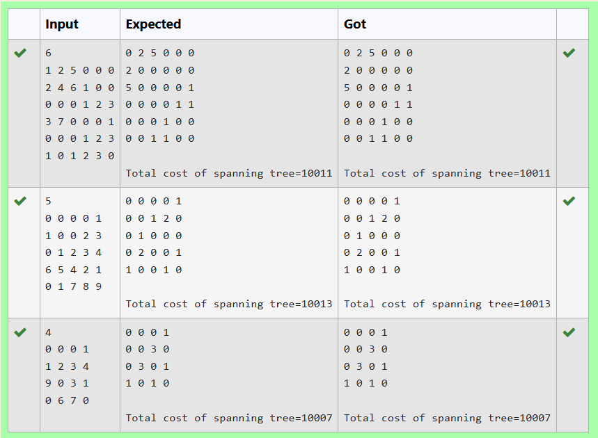

# Ex6(E) Finding Total Cost of Spanning Tree
## DATE:12-05-2025
## AIM:
To write a C Program to implement Prim's Algorithm for finding Total Cost of spanning tree.
## Algorithm
1. Read the number of vertices and the graph as an adjacency matrix.
2. Replace all 0s with infinity to represent no direct edge.
3. Initialize visited, distance, and from arrays.
4. Mark the first vertex as visited and update distances from it.
5. Repeat until n-1 edges are added to the spanning tree.
6. Find the unvisited vertex with the smallest distance.
7. Add the corresponding edge to the spanning tree and mark the vertex as visited.
8. Update the distance and from arrays based on the newly added vertex.
## Program:
```
/*
Program to find and display the priority of the operator in the given Postfix expression
Developed by:MARELLA HASINI 
RegisterNumber:212223240083  
*/
#include<stdio.h>
#include<stdlib.h>
#define infinity 9999
#define MAX 20
int G[MAX][MAX],spanning[MAX][MAX],n;
int prims();
int main()
{
int i,j,total_cost;
scanf("%d",&n);
for(i=0;i<n;i++)
for(j=0;j<n;j++)
scanf("%d",&G[i][j]);
total_cost=prims();
for(i=0;i<n;i++)
{
for(j=0;j<n;j++)
printf("%d ",spanning[i][j]);
printf("\n");
}
printf("\nTotal cost of spanning tree=%d",total_cost);
return 0;
}
int prims()
{
int cost[MAX][MAX];
int u,v,min_distance,distance[MAX],from[MAX];
int visited[MAX],no_of_edges,i,min_cost,j;
//create cost[][] matrix,spanning[][]
for(i=0;i<n;i++)
for(j=0;j<n;j++)
{
if(G[i][j]==0)
cost[i][j]=infinity;
else
cost[i][j]=G[i][j];
spanning[i][j]=0;
}
//initialise visited[],distance[] and from[]
distance[0]=0;
visited[0]=1;
for(i=1;i<n;i++)
{
distance[i]=cost[0][i];
from[i]=0;
visited[i]=0;
}
min_cost=0; //cost of spanning tree
no_of_edges=n-1; //no. of edges to be added
while(no_of_edges>0)
{
//find the vertex at minimum distance from the tree
min_distance=infinity;
for(i=1;i<n;i++)
if(visited[i]==0&&distance[i]<min_distance)
{
v=i;
min_distance=distance[i];
}
u=from[v];
//insert the edge in spanning tree
spanning[u][v]=distance[v];
spanning[v][u]=distance[v];
no_of_edges--;
visited[v]=1;
//updated the distance[] array
for(i=1;i<n;i++)
if(visited[i]==0&&cost[i][v]<distance[i])
{
distance[i]=cost[i][v];
from[i]=v;
}
min_cost=min_cost+cost[u][v];
}
return(min_cost);
}
```

## Output:



## Result:
Thus the C program to implement Prim's Algorithm for finding Total Cost of spanning tree is implemented successfully.
